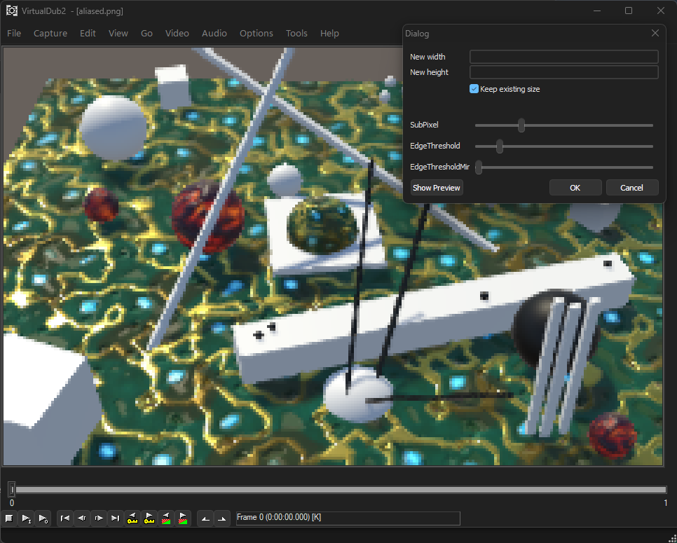

# VDFXAA
FXAA for VirtualDub

This is FXAA Filter adaption for Virtualdub.

Sources:
- Reshade 3.0 (https://github.com/crosire/reshade)
- ^contains FXAA 3.11 from Nvidia
- https://blog.simonrodriguez.fr/articles/2016/07/implementing_fxaa.html

Why?
I can be used to post-process aliased footage from games or other 3d stuff. Though most games nowadays provide a lot of anti-aliasing routines there are cases where none are available, especcially in the retro domain. 

Pre-requisites:
To use this filter you need vdshaders.vdf, which can be found here:
https://virtualdub.org/blog2/entry_231.html

How to use:
You can either open the integrated IDE when loading the vdshaders plugin from the filters configuration window and load the file from there.
Or you can just place the filter "vdfxaa.fx" into the \plugins32\FXFilters folder and it will be autoloaded when starting Virtualdub and presents itself as "FXAA (VDFX)" from the list of available filters. It even provides some adjustable sliders for threshold and subpixel treatment.

Changes made:
The biggest obstacle was that Virtualdub does not understand preprocessors and C++ like intrinsic commands and can also not load .fxh helper files.
The whole filter had to be rewritten and the logic cleaned up for it to work.
Currently it is hardcoded to only provide the standard setting of "FXAA_QUALITY_PRESET 15" which is the best tradeoff between speed and quality.
